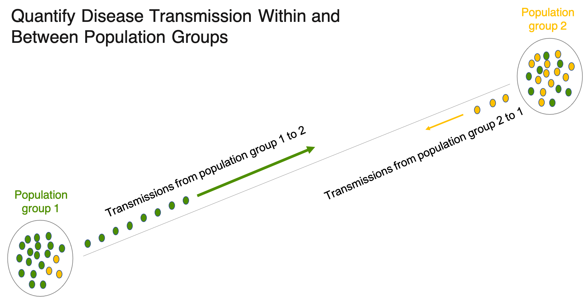

```{r, echo = FALSE, message = FALSE}
# Global options
knitr::opts_chunk$set(
  collapse = TRUE,
  comment = "#>",
  fig.path="fig/"
)
options(tibble.print_min = 4L, tibble.print_max = 4L)
```

{width=95%}

## Background

To control the spread of infectious disease it is important to quantify the impact of
interventions and factors such as: age, sex, socio-economic status and
geographical location in shaping patterns of transmission.

The **_Bumblebee_** package uses counts of directed transmission pairs identified 
between samples from population groups of interest to estimate the flow of transmissions 
within and between those population groups accounting for sampling heterogeneity.

Counts of observed directed transmission pairs can be obtained from deep-sequence 
phylogenetic data (via [phyloscanner](https://github.com/BDI-pathogens/phyloscanner))
or known epidemiological contacts. 

**Note**: Deep-sequence data is also commonly referred to as high-throughput or 
next-generation sequence data.


### Example application areas include: 

1. Quantifying transmission patterns of HIV, the virus that causes AIDS, in the 
   context of HIV prevention initiatives such as universal test-and-treat. 
   
   **To learn more see:** Magosi LE, et al., Deep-sequence phylogenetics to 
   quantify patterns of HIV transmission in the context of a universal testing 
   and treatment trial – BCPP/ Ya Tsie trial. To submit for publication, 2021.
 
2. Quantifying transmission patterns of SARS-COV-2, the virus that causes COVID-19, 
   in the presence of heterogeneous vaccine uptake.


#### This vignette walks through the steps to estimate transmission flows and confidence intervals.
 
---

## Data:

```

We shall use the data of HIV transmissions within and between intervention and control
communities in the BCPP/Ya Tsie HIV prevention trial. 

The BCPP / Ya Tsie study was a pair-matched community-randomized trial involving
30 communities in Botswana to test the effect of a universal HIV test-and-treat 
intervention in efficiently reducing the occurrence of new HIV infections at the 
population level.

To learn more about the data: 

# Counts of directed HIV transmission pairs identified between samples from
# intervention and control communities.
?counts_hiv_transmission_pairs, 

# Estimated number of individuals with HIV in intervention and control
# communities and the number of individuals sampled from each.
?sampling_frequency  

# Estimated transmission flows or relative probability of transmission
# within and between population groups adjusted for variable sampling
# among the population groups. 
# Note: The `theta_hat` variable denotes estimated transmission flows.
?estimated_hiv_transmission_flows
 
```

#### The data was sourced from:

Magosi LE, et al., Deep-sequence phylogenetics to quantify patterns of 
HIV transmission in the context of a universal testing and treatment
trial – BCPP/ Ya Tsie trial. To submit for publication, 2021.


## A basic analysis: Estimating transmission flows within and between population groups

We shall use the `estimate_transmission_flows_and_ci()` function to estimate transmission 
flows and corresponding confidence intervals within and between intervention and control 
communities of the BCPP / Ya Tsie trial.  See `?estimate_transmission_flows_and_ci()` to
learn more about the function.

The `estimate_transmission_flows_and_ci()` function 
requires the following inputs for analysis:

* A character vector of population groups/strata (e.g. communities, age-groups, genders or trial arms) 
  between which to estimate transmission flows.
 
* A numeric vector indicating the number of individuals sampled per population group 

* A numeric vector of the estimated number of individuals per population group 

* A data.frame of counts of directed transmission pairs identified between samples 
  from population groups of interest.


```

# Load libraries  ------------------------------------------------

library(bumblebee) # for estimating transmission flows
library(dplyr)     # for manipulating data.frames


# Estimate transmission flows and confidence intervals  --------------------------

# We shall use the data of HIV transmissions within and between intervention and control
# communities in the BCPP/Ya Tsie HIV prevention trial. To learn more about the data 
# ?counts_hiv_transmission_pairs and ?sampling_frequency 

# View counts of observed directed HIV transmissions within and between 
# intervention and control communities (n = 82)
counts_hiv_transmission_pairs

# View the estimated number of individuals with HIV in intervention and control 
# communities and the number of individuals sampled from each
sampling_frequency

# Estimate transmission flows within and between intervention and control communities
# accounting for variable sampling among population groups. 

# Basic output

results_estimate_transmission_flows_and_ci <- estimate_transmission_flows_and_ci(
    group_in = sampling_frequency$population_group, 
	individuals_sampled_in = sampling_frequency$number_sampled, 
	individuals_population_in = sampling_frequency$number_population, 
	linkage_counts_in = counts_hiv_transmission_pairs)
 
# View results
results_estimate_transmission_flows_and_ci

# Retrieve dataset of estimated transmission flows 
dframe <- results_estimate_transmission_flows_and_ci$flows_dataset

```

## Interpretation of results:

The `theta_hat` variable denotes estimated proportions of HIV transmissions in 
the trial population within and between intervention and control communities.
There was substantial sexual mixing between intervention and control communities.
Transmissions into intervention communities from control communities were three
times more common than the reverse, compatible with a benefit from the universal 
HIV test-and-treat intervention.

#### See `?estimate_transmission_flows_and_ci()` for a description of all the output variables


## A step further: Exploring available options


Further to estimating transmission flows, the bumblebee package provides estimates for:


* p_hat, the probability of linkage between pathogen sequences from two individuals randomly 
  sampled from their respective population groups

* p_group_pairing_linked, the joint probability that a pair of pathogen sequences is 
  from a specific population group pairing and linked

* c_hat, the probability of clustering, more precisely, the probability that a pathogen 
  sequence from one population group links with at least one pathogen sequence from 
  another population group


and confidence intervals for the following methods: 

* Goodman with a continuity correction (useful for small samples) 

* Sison-Glaz

* Queensbury-Hurst


```

# Estimate transmission flows and confidence intervals: Detailed output  -----------------


# Detailed output

results_estimate_transmission_flows_and_ci_detailed <- estimate_transmission_flows_and_ci(
    group_in = sampling_frequency$population_group, 
    individuals_sampled_in = sampling_frequency$number_sampled, 
    individuals_population_in = sampling_frequency$number_population, 
    linkage_counts_in = counts_hiv_transmission_pairs,
    detailed_report = TRUE,
    verbose_output = TRUE)
 
# View results
results_estimate_transmission_flows_and_ci_detailed

# Retrieve dataset of estimated transmission flows 
dframe <- results_estimate_transmission_flows_and_ci_detailed$flows_dataset

```

